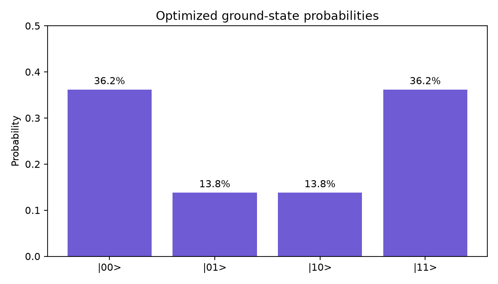

# Quantum Computation Projects

A collection of small, practical quantum-computing projects built with Python
and Qiskit. The tutorials begin with a single qubit and progress toward hybrid
quantum-classical algorithms for finding ground-state energies.

Each project is self-contained and includes commented source code, setup and
run instructions, the underlying physics, experiments to try, and plots that
help explain the results. The collection is intended for students and
developers taking their first steps in quantum computing.

## Projects

| Project | Qubits | Main idea | Key concepts |
| :--- | :---: | :--- | :--- |
| [Quantum Superposition Demo](quantum-superposition-demo/) | 1 | Apply a Hadamard gate and measure the qubit repeatedly | Gates, measurement, simulation, and histograms |
| [VQE Harmonic Oscillator](vqe_harmonic_oscillator/) | 2 | Find the lowest energy of a four-level oscillator model | Hamiltonian encoding, parameterized circuits, and VQE |
| [Ising Model VQE](ising_model_vqe/) | 2 | Find the ground state of two spins in a transverse field | Pauli operators, entanglement, observables, and VQE |

## Suggested learning path

### 1. Quantum superposition

Start with the [superposition demo](quantum-superposition-demo/). It applies a
Hadamard gate to $|0\rangle$, creating

$$
|\psi\rangle=\frac{|0\rangle+|1\rangle}{\sqrt{2}}.
$$

Repeated measurements produce approximately equal numbers of `0` and `1`.
This project introduces the basic Qiskit workflow: construct a circuit, run a
simulator, collect results, and visualize them.

### 2. Variational quantum eigensolver

Continue with the [harmonic-oscillator project](vqe_harmonic_oscillator/). It
introduces the Variational Quantum Eigensolver (VQE), a hybrid algorithm in
which a classical optimizer adjusts a parameterized quantum circuit to minimize
the expected energy.


### 3. Interacting quantum spins

Finish with the [Ising-model project](ising_model_vqe/). It applies VQE to

$$
H=-JZ_0Z_1-h(X_0+X_1),
$$

where the spin interaction and transverse field compete. The optimized state
is an entangled superposition rather than a single classical bit string.



## Quick start

Clone the repository:

```bash
git clone https://github.com/Spa271985/quantum_computation_projects.git
cd quantum_computation_projects
```

Choose a project and create an isolated Python environment. For example:

```bash
cd quantum-superposition-demo
python3 -m venv .venv
source .venv/bin/activate
python -m pip install --upgrade pip
python -m pip install -r requirements.txt
python superposition_demo.py
```

On Windows PowerShell, activate the environment with:

```powershell
.venv\Scripts\Activate.ps1
```

To run either VQE tutorial, return to the repository root, enter its directory,
and use the same environment setup process with that project's requirements:

```bash
# Harmonic oscillator
cd ..
cd vqe_harmonic_oscillator
python3 -m venv .venv
source .venv/bin/activate
python -m pip install -r requirements.txt
python vqe_harmonic_oscillator.py

# Or, after returning to the repository root, the Ising model
cd ..
cd ising_model_vqe
python3 -m venv .venv
source .venv/bin/activate
python -m pip install -r requirements.txt
python ising_model_vqe.py
```

See the README inside each project for complete instructions and command-line
options.

## Common workflow

Although the physical systems differ, the projects follow a shared pattern:

```text
define the problem
       ↓
construct a quantum circuit
       ↓
simulate or evaluate the circuit
       ↓
analyze numerical results
       ↓
create explanatory plots
```

The VQE projects add a feedback loop: a classical optimizer updates the circuit
parameters and repeats the energy calculation until it converges.

## Requirements

- Python 3.10 or newer
- Qiskit 2.x
- NumPy and SciPy for numerical calculations
- Matplotlib for plots

Exact dependencies are listed in each project's `requirements.txt`. The
examples run locally on simulators and do not require an IBM Quantum account.

## Repository structure

```text
quantum_computation_projects/
├── quantum-superposition-demo/
├── vqe_harmonic_oscillator/
├── ising_model_vqe/
├── LICENSE
└── README.md
```

## Ideas for further study

- Run circuit measurements with finite shots instead of exact statevectors
- Add simulated noise and compare it with ideal results
- Execute suitable circuits on quantum hardware
- Extend the Ising chain to three or more spins
- Add an anharmonic $\lambda x^4$ term to the oscillator
- Compare different ansatz circuits and classical optimizers

## Contributing

Suggestions, corrections, and new beginner-friendly examples are welcome.
Please keep additions focused, documented, reproducible, and accompanied by a
short explanation of the relevant quantum concepts.

## License

This repository is available under the [MIT License](LICENSE).
