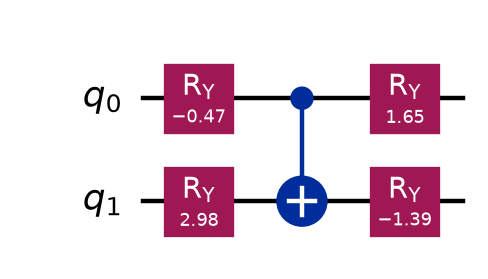
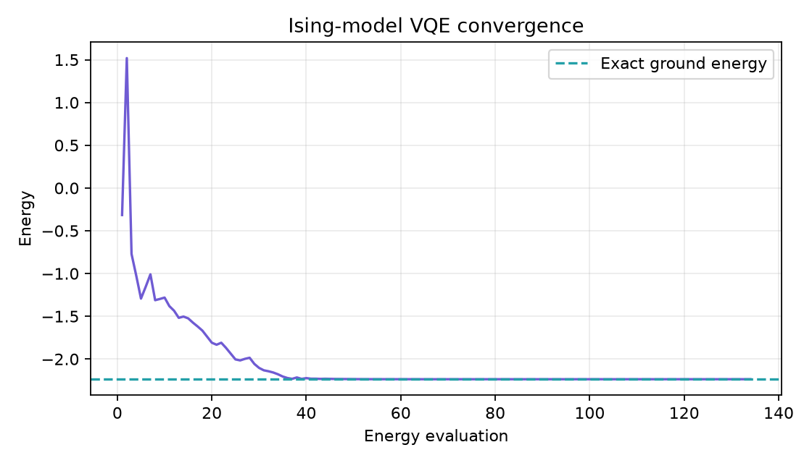
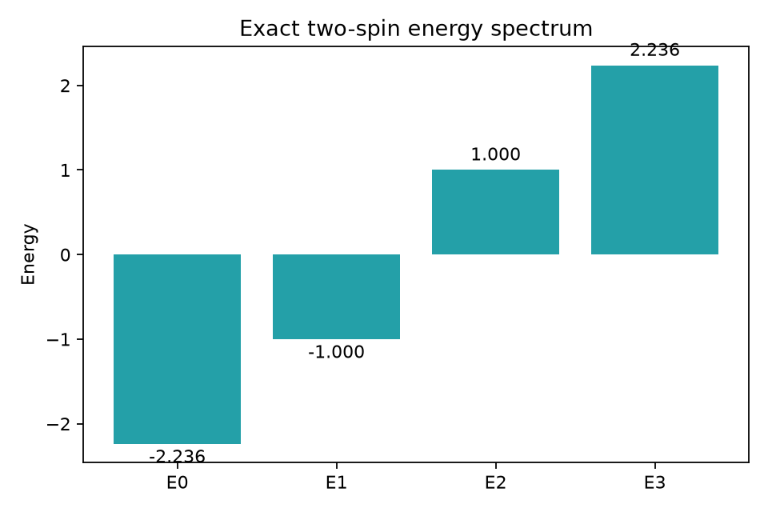

# Ising Model VQE

A beginner-friendly project that uses the **Variational Quantum Eigensolver
(VQE)** to find the ground state of a two-spin transverse-field Ising model.
It combines a parameterized Qiskit circuit with a SciPy optimizer and includes
plots that are visible directly in this README.

## What you will learn

- How qubits represent interacting spins
- How coupling and a transverse field compete
- How to express a Hamiltonian with Pauli operators
- How a parameterized quantum circuit acts as a trial state
- How VQE combines quantum energy calculations with classical optimization

## The model

This project studies two spins with Hamiltonian

$$
H=-JZ_0Z_1-h(X_0+X_1).
$$

- $J$ is the interaction strength. For positive $J$, the $Z_0Z_1$ term favors
  aligned spins: $|00\rangle$ and $|11\rangle$.
- $h$ is the transverse-field strength. The X terms favor superpositions of
  computational-basis states.
- The defaults are $J=1$ and $h=1$, so neither effect can be ignored.

For these defaults, the exact ground energy is $-\sqrt{5}\approx-2.23607$.
The ground state is not just one bit string; it is an entangled superposition.

## VQE workflow

The variational principle says that a trial state's expected energy cannot be
below the true ground-state energy. VQE repeatedly improves that trial state:

```text
choose angles -> run circuit -> calculate <H> -> optimizer updates angles
       ^                                             |
       └──────────── repeat until converged ─────────┘
```

This tutorial uses an exact statevector for expectation values. It therefore
shows the algorithm without sampling noise or hardware noise.

## Project structure

```text
ising_model_vqe/
├── ising_model_vqe.py  # model, ansatz, optimizer, and plots
├── requirements.txt    # Python dependencies
├── plots/              # generated and documented PNG files
└── README.md           # this learning guide
```

## Set up

Python 3.10 or newer is recommended:

```bash
cd ising_model_vqe
python3 -m venv .venv
source .venv/bin/activate
python -m pip install --upgrade pip
python -m pip install -r requirements.txt
```

On Windows PowerShell, activate with `.venv\Scripts\Activate.ps1` instead.

## Run the project

```bash
python ising_model_vqe.py
```

The output reports the VQE and exact energies, their difference, and three
physical expectation values:

- $\langle Z_0Z_1\rangle$ measures spin alignment.
- $\langle X_0\rangle$ and $\langle X_1\rangle$ measure response to the field.

Change the model or optimizer settings from the command line:

```bash
python ising_model_vqe.py --coupling 1.0 --field 0.5 --seed 21 --maxiter 400
```

Run `python ising_model_vqe.py --help` for every option.

## Generated plots

| Plot | Meaning |
| --- | --- |
| `vqe_circuit.png` | Optimized parameterized two-qubit circuit |
| `vqe_convergence.png` | VQE energy compared with the exact ground energy |
| `energy_spectrum.png` | All four exact energies of the two-spin model |
| `ground_state_probabilities.png` | Probability of each computational-basis state |

### VQE circuit



### Optimization convergence



### Exact spectrum



### Ground-state probabilities


## Read the code

1. `ising_hamiltonian()` builds $H$ as a `SparsePauliOp`.
2. `build_ansatz()` creates four Y rotations and a controlled-X gate. The
   controlled gate lets the circuit represent entangled states.
3. `state_and_energy()` binds candidate angles and computes $\langle H\rangle$.
4. `run_vqe()` uses COBYLA to search for angles with minimum energy and also
   diagonalizes the small matrix for an exact comparison.
5. `spin_observables()` calculates correlations that help interpret the state.
6. `save_plots()` turns the circuit and numerical results into PNG images.

## Experiments to try

1. Set `--field 0`. Which two basis states dominate, and why?
2. Set `--coupling 0`. How do the probabilities change when spins do not
   interact?
3. Compare weak (`--field 0.2`) and strong (`--field 3`) transverse fields.
4. Use a negative coupling. Does the model favor aligned or opposite spins?
5. Reduce `--maxiter` to 10 and inspect incomplete convergence.
6. Add a third qubit and the interaction term $-JZ_1Z_2$.

## Scope and limitations

This two-spin model is intentionally small enough to solve exactly. That exact
solution is used only as a learning benchmark; larger Ising models become hard
to diagonalize classically and are more interesting VQE targets. The project
also uses an ideal statevector rather than measurement shots or real hardware.

## Common problems

- **`ModuleNotFoundError`**: activate `.venv` and reinstall the requirements.
- **Optimization stops too early**: increase `--maxiter` or try another seed.
- **A custom run differs from the README plots**: the committed plots use the
  default $J=1$, $h=1$, seed 7 configuration.

## Next steps

Extend the chain to more spins, measure each Pauli term using finite shots, and
compare open boundary conditions with a periodic interaction between the first
and last spin.

Official resources:

- [Qiskit documentation](https://quantum.cloud.ibm.com/docs/en/guides)
- [IBM Quantum Learning](https://quantum.cloud.ibm.com/learning)

## License

This project is covered by the license in the repository root.
