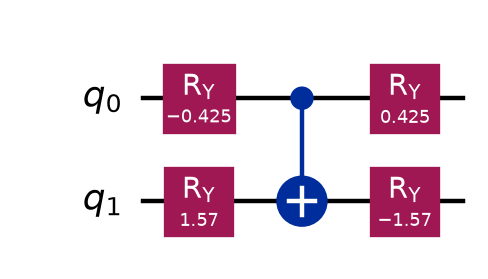
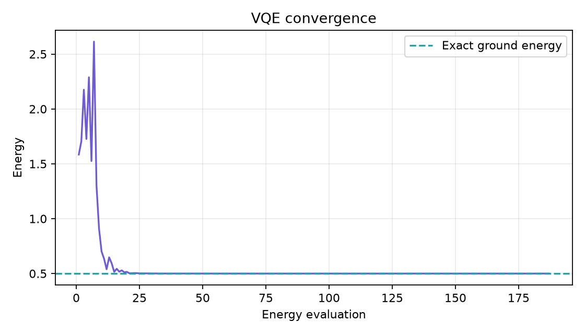
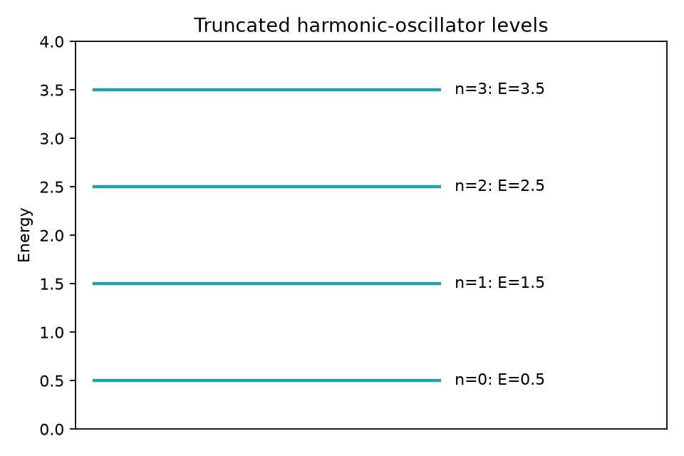
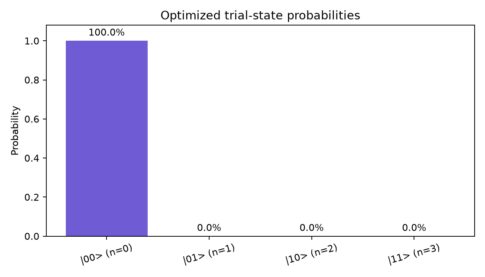

# VQE Harmonic Oscillator

A beginner-friendly project that uses the **Variational Quantum Eigensolver
(VQE)** to approximate the ground-state energy of a quantum harmonic
oscillator. It combines a parameterized Qiskit circuit with a classical SciPy
optimizer and produces four explanatory plots.

## What you will learn

- What a Hamiltonian and ground state represent
- How oscillator energy levels can be encoded with qubits
- How to construct a parameterized quantum ansatz
- How the quantum and classical parts of VQE work together
- How to interpret convergence and state-probability plots

## Physics model

In units where $\hbar\omega=1$, the harmonic oscillator has energies

$$
E_n=n+\frac{1}{2}, \qquad n=0,1,2,\ldots
$$

Its exact ground-state energy is therefore $E_0=0.5$. A real oscillator has
infinitely many levels. To fit a small learning example onto two qubits, this
project keeps only the first four:

| Qubit state | Oscillator level | Energy |
| --- | ---: | ---: |
| $|00\rangle$ | 0 | 0.5 |
| $|01\rangle$ | 1 | 1.5 |
| $|10\rangle$ | 2 | 2.5 |
| $|11\rangle$ | 3 | 3.5 |

For this binary encoding, the Hamiltonian is

$$
H=2I-\frac{1}{2}Z_0-Z_1.
$$

The Pauli-Z terms make each encoded state reproduce the corresponding energy
in the table.

## What VQE does

VQE is a hybrid quantum-classical algorithm:

```text
choose angles -> prepare trial state -> calculate <H> -> update angles
       ^                                                  |
       └──────────────── repeat until converged ──────────┘
```

The variational principle says that any normalized trial state's expected
energy is at least the true ground energy. A classical optimizer changes the
circuit angles to find the lowest expectation value it can.

This example computes expectation values exactly from a statevector. That keeps
the first project focused on VQE itself; measurements and noisy hardware can be
added later.

## Project structure

```text
vqe_harmonic_oscillator/
├── vqe_harmonic_oscillator.py  # Hamiltonian, ansatz, VQE, and plots
├── requirements.txt            # Python dependencies
├── plots/                      # generated PNG files
└── README.md                   # this guide
```

## Set up

Python 3.10 or newer is recommended:

```bash
cd vqe_harmonic_oscillator
python3 -m venv .venv
source .venv/bin/activate
python -m pip install --upgrade pip
python -m pip install -r requirements.txt
```

On Windows PowerShell, activate with `.venv\Scripts\Activate.ps1` instead.

## Run VQE

```bash
python vqe_harmonic_oscillator.py
```

Typical output is:

```text
VQE ground energy: 0.50000000
Exact ground energy: 0.50000000
Absolute error: ...
```

The optimizer begins from random circuit angles, but the default seed makes the
example reproducible. Change the seed or iteration limit with:

```bash
python vqe_harmonic_oscillator.py --seed 21 --maxiter 400
```

Run `python vqe_harmonic_oscillator.py --help` for every option.

## Generated plots

| Plot | Meaning |
| --- | --- |
| `vqe_circuit.png` | Optimized two-qubit ansatz circuit |
| `vqe_convergence.png` | Trial energy during classical optimization |
| `energy_levels.png` | Four oscillator levels retained in the model |
| `optimized_state.png` | Probability of each encoded level after VQE |

The optimized-state plot should be concentrated at $|00\rangle$, because it
encodes the lowest oscillator level.

### VQE circuit



### Optimization convergence



### Truncated energy levels



### Optimized state



## Read the code

1. `harmonic_oscillator_hamiltonian()` creates the Pauli representation of $H$.
2. `build_ansatz()` constructs rotation gates and a controlled-X entangling
   gate. Its four angles are the variables VQE will learn.
3. `state_and_energy()` prepares a candidate state and evaluates $\langle
   \psi|H|\psi\rangle$.
4. `run_vqe()` asks the COBYLA optimizer to minimize that energy.
5. `save_plots()` visualizes the model, circuit, progress, and final state.

The controlled-X gate is not required for this simple diagonal ground state,
but it gives the ansatz a form that can also represent correlated two-qubit
states in harder problems.

## Experiments to try

1. Run with several seeds. Do all runs approach 0.5?
2. Use `--maxiter 10`. What does an unfinished convergence plot look like?
3. Remove the final pair of `ry` gates. Can the smaller ansatz still find the
   ground state?
4. Change the Hamiltonian coefficients and predict the new lowest basis state.
5. Replace exact statevector energies with shot-based Pauli measurements and
   observe statistical noise.

## Scope and limitations

This is an educational truncated model. It represents only four energy levels
and runs on an ideal local statevector, not quantum hardware. More advanced
oscillator simulations may encode position and momentum operators, use more
qubits, include interactions, and estimate each Hamiltonian term from circuit
measurements.

## Common problems

- **`ModuleNotFoundError`**: activate `.venv` and reinstall the requirements.
- **The optimizer reports that it stopped early**: increase `--maxiter`.
- **The energy is slightly above 0.5**: numerical optimizers use finite
  tolerances; a tiny residual error is normal.

## Next steps

After understanding this example, try an anharmonic oscillator by adding a
$\lambda x^4$ term. Its Hamiltonian is no longer diagonal in this small basis,
so the circuit must learn a genuine mixture of oscillator levels.

Official resources:

- [Qiskit documentation](https://quantum.cloud.ibm.com/docs/en/guides)
- [IBM Quantum Learning](https://quantum.cloud.ibm.com/learning)

## License

This project is covered by the license in the repository root.
